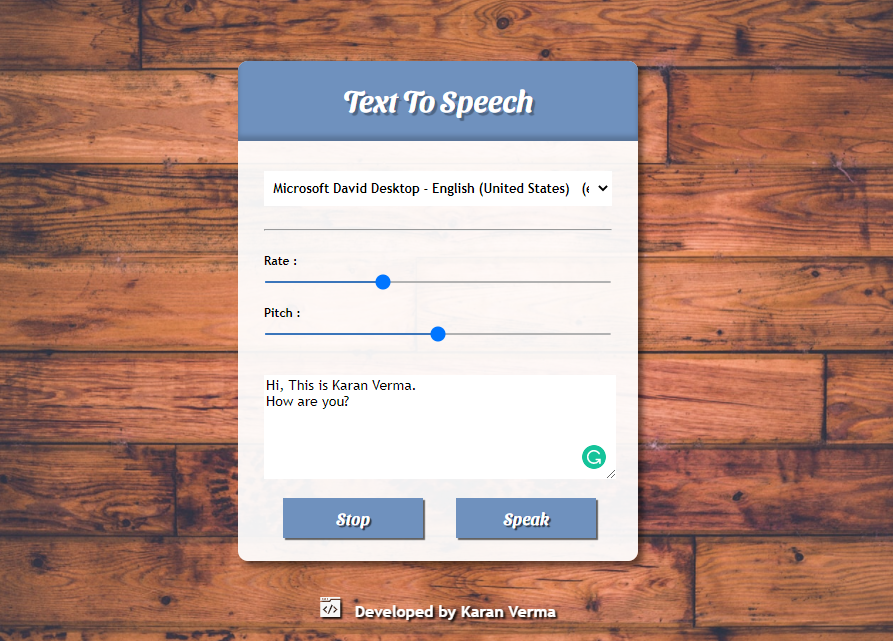

# Text to Speech Converter

## About the Project


                              Text to speech converter, give input in the text field and listen.
                                Select any voice from the dropdown, change it's rate or pitch.
                                Play around with different combinations and most importantly, have fun.

## Getting Started

To get a local copy of the project up and running, follow these simple steps:

1. Clone the repository
```sh
git clone https://github.com/karanverma7/text2speech.git
```

2. Install Visual Studio Code
3. Install Live Server Extension within VS code.
4. Open the html file with live server.
5. It's that simple!
    

## License

Distributed under the MIT License. See `LICENSE` for more information.

## Contact
Karan Verma (karanverma1601@gmail.com)
